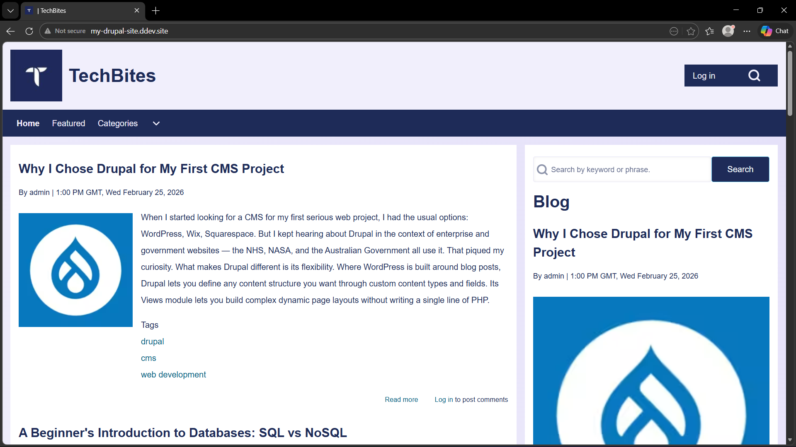
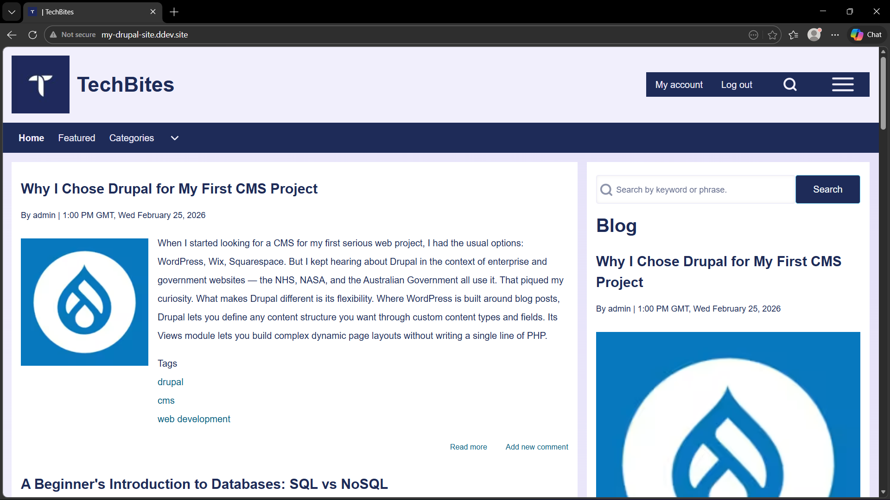
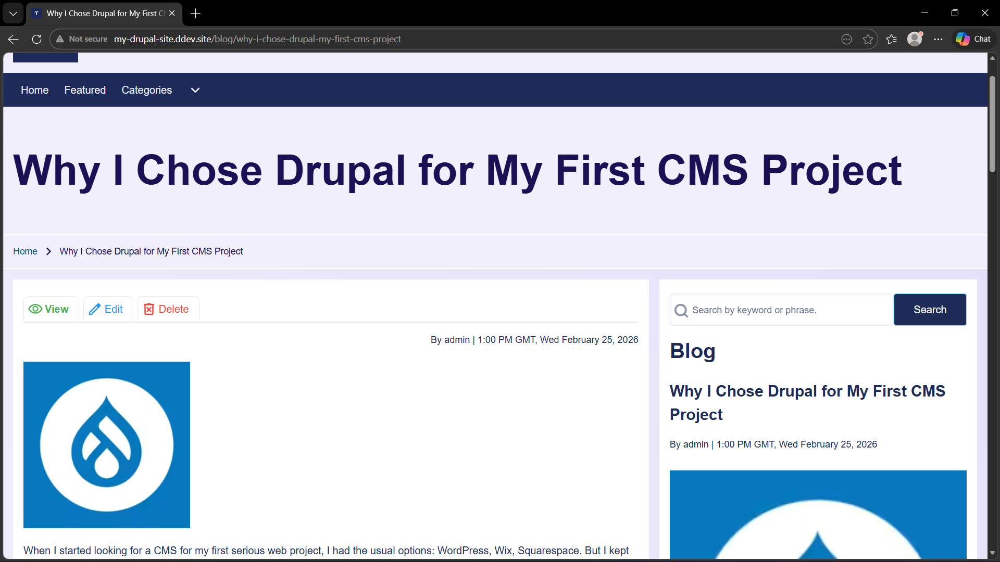

# TechBites — Drupal Blog Project

A fully functional blog website built with Drupal 11 as part of my journey learning enterprise-level CMS development. This project covers everything from custom content types and Views to user roles, URL aliases, and theme customization.

---

## 🌐 About the Project

TechBites is a tech-focused blog site where articles can be created, categorized, and featured. It demonstrates real-world Drupal concepts including content management, role-based access control, and dynamic page layouts using the Views module.

This was built as a learning project to understand how Drupal works as a CMS compared to platforms like WordPress.

---

## ✨ Features

- **Custom Content Type** — Article content type with fields for title, body, featured image, tags, and a "Featured Post" flag
- **Views** — Dynamic blog listing and featured posts sidebar built with Drupal's Views module
- **User Roles** — Three roles configured: Admin, Editor (manage all content), and Author (manage own content only)
- **URL Aliases** — Clean, SEO-friendly URLs generated automatically via Pathauto (e.g. `/blog/why-i-chose-drupal`)
- **Taxonomy** — Tag and category system for organizing articles
- **Webform** — Contact form with email notifications
- **Custom Theme** — Solo theme with custom logo, color scheme, and sidebar layout
- **Search** — Keyword search across all published content
- **Responsive Layout** — Two-column layout with main content and sidebar

---

## 🛠 Tech Stack

| Technology | Purpose |
|------------|---------|
| Drupal 11 | CMS Framework |
| PHP 8.3 | Backend language |
| MySQL / MariaDB | Database |
| Composer | PHP dependency management |
| DDEV | Local development environment |
| Docker | Container runtime |
| Git | Version control |

**Key Drupal Modules Used:**
- Views & Views UI
- Pathauto + Token
- Redirect
- Webform
- Taxonomy
- Solo (contributed theme)

---

## 🚀 Local Setup

Follow these steps to run this project locally.

### Prerequisites

- [DDEV](https://ddev.readthedocs.io/en/stable/) installed
- [Docker](https://www.docker.com/) installed and running
- [Composer](https://getcomposer.org/) installed
- Git installed

### Installation

1. **Clone the repository**
   ```bash
   git clone https://github.com/wthoreo/Drupal-Project.git
   cd Drupal-Project
   ```

2. **Install PHP dependencies**
   ```bash
   ddev composer install
   ```

3. **Start DDEV**
   ```bash
   ddev start
   ```

4. **Import the database**
   ```bash
   ddev import-db --file=drupal-backup.sql.gz
   ```

5. **Clear cache**
   ```bash
   ddev drush cr
   ```

6. **Open in browser**
   ```
   http://my-drupal-site.ddev.site
   ```

### Default Admin Login
- **Username:** admin
- **Password:** *(set up your own after import)*

---

## 👥 User Roles & Access Control

This project implements role-based access control with three distinct user roles, each with a different view and set of permissions.

### Role Overview

| Role | What They Can Do |
|------|-----------------|
| **Admin** | Full access to everything — manage users, modules, theme, and all content |
| **Editor** | Access the admin panel, create/edit/delete any article regardless of who wrote it |
| **Author** | Create and manage their own articles only, no access to other users' content |
| **Anonymous** | View published content, use search, access the contact form |

### What Each Role Sees

**Anonymous visitor** — sees the clean public-facing site with no editing options. Only a Log in button is visible in the top right.



**Author** — after logging in, the header shows "My account" and "Log out". A hamburger menu (☰) appears in the top right corner which opens a sidebar containing a "Write a new post" link — this is only visible to Authors and takes them directly to the article creation form. Authors cannot edit other users' content.



**Editor** — when viewing any blog post, the Editor sees View, Edit, and Delete buttons at the top of the article. This gives them full control over all content on the site regardless of who wrote it.



### How to Set Up Roles

After importing the database, the roles will already be configured. If you want to set them up from scratch:

1. Go to **People → Roles → Add Role** and create `Editor` and `Author` roles

2. For the **Editor** role, go to **Edit permissions** and enable:
   - Node: Create/Edit/Delete any Article content
   - Access the Content overview page
   - Access administration pages
   - Use the Basic HTML text format

3. For the **Author** role, go to **Edit permissions** and enable:
   - Node: Create new Article content
   - Node: Edit own Article content
   - Node: Delete own Article content
   - Access the Files overview page

4. To create test users, go to **People → Add user**, fill in a username, email, and password, and assign the appropriate role.

### Test Credentials

After importing the database you can create test users at **People → Add user**:
- Create a user with the **Editor** role to test editing any content
- Create a user with the **Author** role to test the restricted content creation view

---

## 📁 Project Structure

```
├── web/
│   ├── core/               # Drupal core (managed by Composer)
│   ├── modules/
│   │   └── contrib/        # Contributed modules (managed by Composer)
│   ├── themes/
│   │   └── contrib/solo/   # Solo theme
│   └── sites/default/      # Site configuration and uploaded files
├── composer.json            # PHP dependencies
├── drupal-backup.sql.gz     # Database snapshot
└── README.md
```

---

## 📚 What I Learned

- How Drupal's entity system works (nodes, fields, taxonomy, users)
- Building dynamic content displays with Views without writing SQL
- Role-based access control and permission management
- Using Composer and DDEV for professional local development workflows
- Theme customization in Drupal
- Syncing a CMS project across multiple machines using Git + database exports

---

## 👤 Author

**Orion Bhattacharya**  
Learning web development and CMS platforms.  
GitHub: [@wthoreo](https://github.com/wthoreo)
